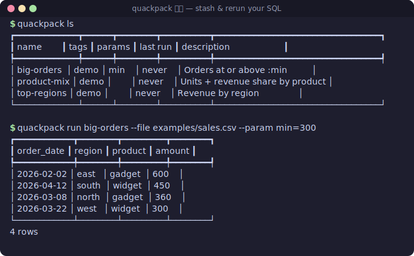

# quackpack 🦆📦

**A personal pantry for your SQL.** Stash any ad-hoc DuckDB/SQLite query, give it a name,
tags, and `:params`, then rerun it instantly against any data file — no more re-typing that
gnarly one-liner you wrote three weeks ago.

It's like `tldr`/`navi` cheatsheets, but for *your own* analytical SQL. Your throwaway
queries become reusable tools without becoming things you have to maintain.

> Status: 🏗️ v0.1 nearly done. **M5 (`search`, `edit`, run history) is live**, and
> there's now a bundled [`examples/`](./examples) quickstart you can run in ~2 minutes.
> See [PLAN.md](./PLAN.md) for the full roadmap.

## Demo

Stash three queries, then rerun them against a CSV — including a bound `:param` and
JSON out — in seconds:

[](./demo/quackpack.cast)

> Everything above is **real, reproducible CLI output**, not a mock-up. The still
> is generated from actual runs against the bundled [`examples/`](./examples)
> dataset; click it for the recorded [asciinema cast](./demo/quackpack.cast)
> (`asciinema play demo/quackpack.cast`). To (re)render an animated GIF, run
> `vhs demo/demo.tape` ([VHS](https://github.com/charmbracelet/vhs)). It's all
> driven by [`demo/demo.sh`](./demo/demo.sh), which CI exercises so the demo
> can't drift — see [`demo/README.md`](./demo/README.md). Prefer text? Just run
> `demo/demo.sh`.

## Why

DuckDB is the daily driver for slicing CSV/Parquet/SQLite — and every power user ends up
with a graveyard of great one-off queries lost in shell history and scratch files. The
engine is solved; the *workflow around it* is still messy. quackpack is the missing,
local-first, zero-server bit: **save the query, rerun the query.**

## Quickstart (≈2 minutes)

The repo ships a tiny sample dataset and three starter queries in
[`examples/`](./examples). From the repo root:

```console
# Use a throwaway pack so this never touches your real one:
$ export QUACKPACK_HOME="$(mktemp -d)"

# Stash the three starter queries (or load them all at once with
# `export QUACKPACK_HOME="$PWD/examples"` to use the bundled pack):
$ quackpack add -n top-regions -f examples/top-regions.sql --tags demo --desc "Revenue by region"
$ quackpack add -n big-orders  -f examples/big-orders.sql  --tags demo --desc "Orders at or above :min"
$ quackpack add -n product-mix -f examples/product-mix.sql --tags demo --desc "Units + revenue share by product"

# Run one against the sample CSV (the relation name is the file stem, `sales`):
$ quackpack run top-regions --file examples/sales.csv
┏━━━━━━━━┳━━━━━━━━━┳━━━━━━━┓
┃ region ┃ revenue ┃ units ┃
┡━━━━━━━━╇━━━━━━━━━╇━━━━━━━┩
│ east   │ 995     │ 15    │
│ south  │ 970     │ 19    │
│ west   │ 845     │ 13    │
│ north  │ 700     │ 11    │
└────────┴─────────┴───────┘
4 rows

# Bind a :param (or omit it to be prompted):
$ quackpack run big-orders --file examples/sales.csv --param min=300
```

More in [`examples/README.md`](./examples/README.md).

## Usage (available now)

Save a query — inline, from a file, or piped on stdin. Any `:param` placeholders are
detected and recorded automatically.

```console
$ quackpack add --name top-errors --tags logs,triage --desc "5xx by path" \
    -q "SELECT path, count(*) c FROM read_parquet(:src) WHERE status >= 500 GROUP BY 1 ORDER BY c DESC LIMIT :n"
saved top-errors  tags: logs, triage  params: src, n

$ cat report.sql | quackpack add --name monthly-revenue --tags finance
$ quackpack add --name quick -f ./queries/quick.sql
```

List, filter, inspect, and remove. `ls` shows when each query was **last run** (with an
`(error)` flag if the last run failed):

```console
$ quackpack ls
┏━━━━━━━━━━━━┳━━━━━━━━━━━━━━┳━━━━━━━━┳━━━━━━━━━━┳━━━━━━━━━━━━┓
┃ name       ┃ tags         ┃ params ┃ last run ┃ description┃
┡━━━━━━━━━━━━╇━━━━━━━━━━━━━━╇━━━━━━━━╇━━━━━━━━━━╇━━━━━━━━━━━━┩
│ top-errors │ logs, triage │ src, n │ 2d ago   │ 5xx by path│
└────────────┴──────────────┴────────┴──────────┴────────────┘

$ quackpack ls --tag finance          # filter by tag
$ quackpack show top-errors           # SQL + metadata + run history (highlighted)
$ quackpack rm top-errors --yes       # remove (omit --yes to confirm)
```

### Find & edit

As your pack grows, `search` recalls a query by *anything* you remember about it — it
substring-matches (case-insensitively) across name, SQL body, description, and tags:

```console
$ quackpack search 5xx           # matches the description
$ quackpack search read_parquet  # matches the SQL body
$ quackpack search triage        # matches a tag
┏━━━━━━━━━━━━┳━━━━━━━━━━━━━━┳━━━━━━━━┳━━━━━━━━━━┳━━━━━━━━━━━━┓
┃ name       ┃ tags         ┃ params ┃ last run ┃ description┃
┡━━━━━━━━━━━━╇━━━━━━━━━━━━━━╇━━━━━━━━╇━━━━━━━━━━╇━━━━━━━━━━━━┩
│ top-errors │ logs, triage │ src, n │ 2d ago   │ 5xx by path│
└────────────┴──────────────┴────────┴──────────┴────────────┘
1 match
```

Tweak a stored query in your editor — quackpack opens the SQL in `$EDITOR` (or `--editor`)
and **re-detects `:params` on save**, so adding or removing a placeholder just works:

```console
$ quackpack edit top-errors       # opens $VISUAL / $EDITOR (vi by default)
updated top-errors  params: src, n, since
```

### Run a query

`quackpack run <name>` executes a saved query against a data target and renders the
results. Point it at a file with `--file` (CSV / Parquet / SQLite) or a database with
`--db` (DuckDB or SQLite). DuckDB is the default engine; pass `--engine sqlite` to force
the dependency-free fallback.

```console
# Reference a --file by its stem (sales.csv -> the `sales` relation):
$ quackpack add -n top-regions -q "SELECT region, sum(amount) AS total FROM sales GROUP BY 1 ORDER BY total DESC"
$ quackpack run top-regions --file sales.csv
┏━━━━━━━━┳━━━━━━━┓
┃ region ┃ total ┃
┡━━━━━━━━╇━━━━━━━┩
│ east   │   250 │
│ west   │   175 │
└────────┴───────┘
2 rows

# Same query, a Parquet file, piped out as CSV:
$ quackpack run top-regions --file sales.parquet --format csv

# Bind :params and emit JSON for jq/scripts:
$ quackpack add -n big -q "SELECT * FROM sales WHERE amount > :min ORDER BY amount"
$ quackpack run big --file sales.csv --param min=90 --format json

# Omit a param and quackpack prompts for it (when run in a terminal):
$ quackpack run big --file sales.csv
param min: 90
┏━━━━━━━━┳━━━━━━━━┓
┃ region ┃ amount ┃
┡━━━━━━━━╇━━━━━━━━┩
│ west   │    100 │
│ east   │    250 │
└────────┴────────┘

# Query tables inside a database file (DuckDB or SQLite):
$ quackpack run big --db shop.duckdb --param min=90
$ quackpack run big --db shop.sqlite --param min=90 --engine sqlite
```

Notes:

- **Relation name** = the data file's stem, sanitised (`my data.csv` → `my_data`). You can
  also use DuckDB table functions directly, e.g. `... FROM read_csv_auto('sales.csv')` or
  `read_parquet('data/*.parquet')`.
- **`--param key=value`** is repeatable and bound via the driver's native prepared
  statements (no string interpolation). quackpack stores `:name` placeholders and
  translates them to DuckDB's `$name` automatically. Values are **typed automatically** as
  `int` / `float` / `str` so numeric filters compare numerically; force a type with a
  `key:type` hint, e.g. `--param zip:str=00501` (keep the leading zero) or
  `--param n:int=5`. **Any declared param you don't pass is prompted for interactively**
  when running in a terminal; in pipes/CI it just warns so nothing hangs.
- **`--format`**: `table` (default), `csv`, or `json`.
- **`--engine`**: `auto` (DuckDB if installed, else SQLite), `duckdb`, or `sqlite`. The
  SQLite fallback ingests CSVs (inferring numeric columns) and reads `.sqlite` files;
  Parquet requires DuckDB.

### Param presets (saved bindings)

One parameterized query becomes many one-keystroke reports. Save a named set of `:param`
values on a query, then replay it with `run --preset <name>`. Presets are stored alongside
the query in the catalog, so they travel with your pack.

```console
# Save a preset (values are typed just like --param; key:type hints work too):
$ quackpack preset add sales q3-2026 --param region=west --param min:int=100
saved preset q3-2026 on sales  min=100, region=west

# List a query's presets (also shown in `quackpack show sales`):
$ quackpack preset ls sales
┏━━━━━━━━━┳━━━━━━━━━━━━━━━━━━━━━━━┓
┃ preset  ┃ bindings              ┃
┡━━━━━━━━━╇━━━━━━━━━━━━━━━━━━━━━━━┩
│ q3-2026 │ min=100, region=west  │
└━━━━━━━━━┴━━━━━━━━━━━━━━━━━━━━━━━┘

# Replay the canned report in one keystroke:
$ quackpack run sales --preset q3-2026 --file sales.csv

# Override just one value on top of a preset (--param wins over the preset):
$ quackpack run sales --preset q3-2026 --param region=east --file sales.csv

# Remove a preset:
$ quackpack preset rm sales q3-2026
```

Precedence when a `--preset` and `--param` collide: the preset supplies the base values,
explicit `--param` flags override them, and anything still missing is prompted for (in a
terminal) or warned about (in pipes/CI) — same as a plain `run`.

### Query composition (`{{ templating }}`)

Factor a common cleaning step or join into one query, then reference it from others with
`{{ query_name }}`. Each reference is inlined as a parenthesised subquery and the whole
thing is resolved to a single flat SQL string before it runs, so your building blocks stay
DRY without any copy-paste.

```console
# A reusable base query...
$ quackpack add --name orders_clean \
    -q "select * from read_csv_auto(:file) where status <> 'void'"

# ...composed into a bigger one:
$ quackpack add --name big_orders \
    -q "select * from {{ orders_clean }} where amount > :threshold"

# show lists what a query pulls in:
$ quackpack show big_orders
big_orders
params: threshold  |  runs: 0  |  last run: never
references: orders_clean
select * from {{ orders_clean }} where amount > :threshold

# --expanded previews the flattened SQL that run will execute:
$ quackpack show --expanded big_orders
...
select * from (select * from read_csv_auto(:file) where status <> 'void')
  where amount > :threshold

# run expands + binds params from every level (:file here comes from orders_clean):
$ quackpack run big_orders --file orders.csv --param threshold=500
```

References can nest to any depth. Cycles (`a → b → a`, or a query that references itself)
and unknown references are caught up front with a clean `error:` and a non-zero exit —
nothing half-expanded ever reaches the engine. A `{{ … }}` inside a string literal is left
alone, so it never gets mistaken for a reference.

### Stash on the fly (`pipe`)

Got a throwaway query you might want to keep? `quackpack pipe` runs SQL straight from
stdin (or `-q` / `--sql-file`) — **no `add` first** — then offers to stash it. It takes the
same execution flags as `run` (`--file` / `--db`, `--param`, `--format`, `--engine`).

```console
# Pipe a query in, see the result, then decide:
$ echo "SELECT region, sum(amount) AS total FROM sales GROUP BY 1 ORDER BY total DESC" \
    | quackpack pipe --file sales.csv
┏━━━━━━━━┳━━━━━━━┓
┃ region ┃ total ┃
┡━━━━━━━━╇━━━━━━━┩
│ east   │   250 │
│ west   │   175 │
└────────┴───────┘
2 rows
stash as [name] (blank to skip): top-regions
stashed top-regions

# One-shot, scriptable stash (no prompt):
$ echo "SELECT count(*) AS n FROM sales" \
    | quackpack pipe --file sales.csv --save-as rowcount --tags adhoc

# Just run it, never ask:
$ cat scratch.sql | quackpack pipe --file sales.csv --no-save
```

Notes:

- **Interactive prompt** only appears at a real terminal; a blank name skips saving. When
  SQL is piped on stdin there's no TTY to prompt on, so use `--save-as NAME` to keep it.
- **The nudge.** quackpack remembers your recent pipes (in `~/.quackpack/pipes.json`,
  fingerprinted so formatting differences don't matter). Pipe the *same* query again and it
  flags how many times you've run it — *"you've piped this 3× — worth stashing?"*.
- Saved queries get their `:param` placeholders detected automatically, exactly like `add`.

### Result snapshots & diff

Every successful `run` quietly **caches its result**, so `quackpack diff <name>` can answer
the one question that matters for a spot check: *what changed since the last time I ran
this?* It re-runs the query and shows the delta — added rows, removed rows, and (when you
record a `--key`) rows whose values **changed**, column by column. This is deliberately a
lightweight data-drift / regression check, not BI: no dashboards, just the diff.

```console
# Run once to seed a snapshot. Pass --key so diff can spot *changed* rows
# (not just added/removed). Omit --key to match on whole rows.
$ quackpack run sales --file sales.csv --key id

# ...data changes (a row edited, one dropped, one added)...
$ quackpack diff sales --file sales.csv
diff sales vs snapshot from 2h ago (key: id)
┏━━━┳━━━━┳━━━━━━━━┳━━━━━━━━┓
┃ + ┃ id ┃ region ┃ amount ┃
┡━━━╇━━━━╇━━━━━━━━╇━━━━━━━━┩
│ + │ 4  │ north  │ 50     │
└───┴────┴────────┴────────┘
┏━━━┳━━━━┳━━━━━━━━┳━━━━━━━━┓
┃ - ┃ id ┃ region ┃ amount ┃
┡━━━╇━━━━╇━━━━━━━━╇━━━━━━━━┩
│ - │ 3  │ west   │ 75     │
└───┴────┴────────┴────────┘
┏━━━┳━━━━┳━━━━━━━━━━━━━━━━━━━┓
┃ ~ ┃ id ┃ changes           ┃
┡━━━╇━━━━╇━━━━━━━━━━━━━━━━━━━┩
│ ~ │ 2  │ amount: 250 → 999 │
└───┴────┴───────────────────┘
+1 added, -1 removed, ~1 changed

# Re-baseline to the current result as you diff (so the *next* diff is clean):
$ quackpack diff sales --file sales.csv --update

# Override the identity for one diff, or inspect/clear the cache:
$ quackpack diff sales --file sales.csv --key region
$ quackpack snapshot show sales      # what the next diff compares against
$ quackpack snapshot rm sales        # forget it (next run re-seeds)
```

Notes:

- **`diff` takes the same targeting flags as `run`** (`--file` / `--db`, `--param`,
  `--preset`, `--engine`), since it re-executes the query before comparing.
- **Keyed vs whole-row.** With a `--key` (a column, or several for a composite key), rows
  are matched by that identity and value changes are reported as `old → new`. Without one,
  identity is the entire row, so a value change reads as a remove + an add.
- **Opt out** of caching on a given run with `run --no-snapshot`.
- Snapshots live in `~/.quackpack/snapshots/` (one small JSON per query, separate from
  `pack.yaml` so cached data never bloats your catalog).

### Where queries live

A single human-readable, diffable YAML file at `~/.quackpack/pack.yaml`. Set
`QUACKPACK_HOME` to relocate it (e.g. point it inside a git repo to version your pack):

```yaml
version: 1
queries:
  - name: top-errors
    sql: SELECT path, count(*) c FROM read_parquet(:src) WHERE status >= 500 ...
    tags: [logs, triage]
    desc: 5xx by path
    created: "2026-06-22T19:44:07+00:00"
    params: [src, n]
    run_count: 4
    last_run: "2026-06-25T19:40:00+00:00"
    last_status: ok
```

Every `quackpack run` bumps `run_count` / `last_run` / `last_status`, which is what powers
the "last run" column in `ls` and the run summary in `show`.

### Exit codes

quackpack follows the usual CLI convention, so it composes cleanly in scripts and CI:

- **`0`** — success. An empty result set (e.g. `search` / `ls` with no matches) is *not*
  an error; it still exits `0`.
- **`1`** — a runtime or user error (unknown query, bad `--param`/`--format`/`--engine`,
  a SQL or file error). These print a uniform `error: …` message to stderr.
- **`2`** — a usage error (missing/invalid arguments), surfaced by the CLI parser.

```console
$ quackpack run nope --file data.csv; echo "exit=$?"
error: No query named 'nope'.
exit=1
```

## Coming next (finishing M6)

Discovery and recall are done (M5: `search`, `edit`, run history), the
[`examples/`](./examples) quickstart has landed, and the release plumbing is in
place — a [`CHANGELOG.md`](./CHANGELOG.md) plus a tag-driven
[release workflow](./.github/workflows/release.yml) that builds and verifies the
sdist/wheel and attaches them to the GitHub Release (PyPI publish is opt-in via a
repo secret). Shipping `v0.1.0` is now a one-liner for a maintainer:

```console
git tag v0.1.0 && git push origin v0.1.0
```

The [demo](#demo) is now wired up too: the README shows a real, reproducible
still ([`demo/quackpack.svg`](./demo/quackpack.svg)) plus a recorded asciinema
cast ([`demo/quackpack.cast`](./demo/quackpack.cast)), both generated from a
CI-guarded walkthrough ([`demo/demo.sh`](./demo/demo.sh)); a
[VHS](https://github.com/charmbracelet/vhs) tape ([`demo/demo.tape`](./demo/demo.tape))
renders an animated GIF on demand. So the only remaining maintainer steps are
(optionally) committing that GIF and tagging the `v0.1.0` release above.
Every command's `--help` is now Markdown-rendered (clean inline-code, no stray
markup), and exit codes follow the usual convention so quackpack scripts
predictably (see [Exit codes](#exit-codes)).

## Install

From source today (PyPI publish lands with `v0.1.0`):

```console
# With uv (recommended):
uv tool install git+https://github.com/rwrife/quackpack

# Or with pipx:
pipx install git+https://github.com/rwrife/quackpack

# Or a plain editable dev install:
git clone https://github.com/rwrife/quackpack && cd quackpack
pip install -e ".[dev]"
```

Once v0.1 is published:

```console
pipx install quackpack    # or: uv tool install quackpack
```

## Tech

Python · DuckDB · Typer · Rich · YAML. Boring on purpose.

## License

MIT (see `LICENSE`). Release history lives in [`CHANGELOG.md`](./CHANGELOG.md).

---

Part of an automated tool-lab experiment. Topic: `auto-tool-lab`.
